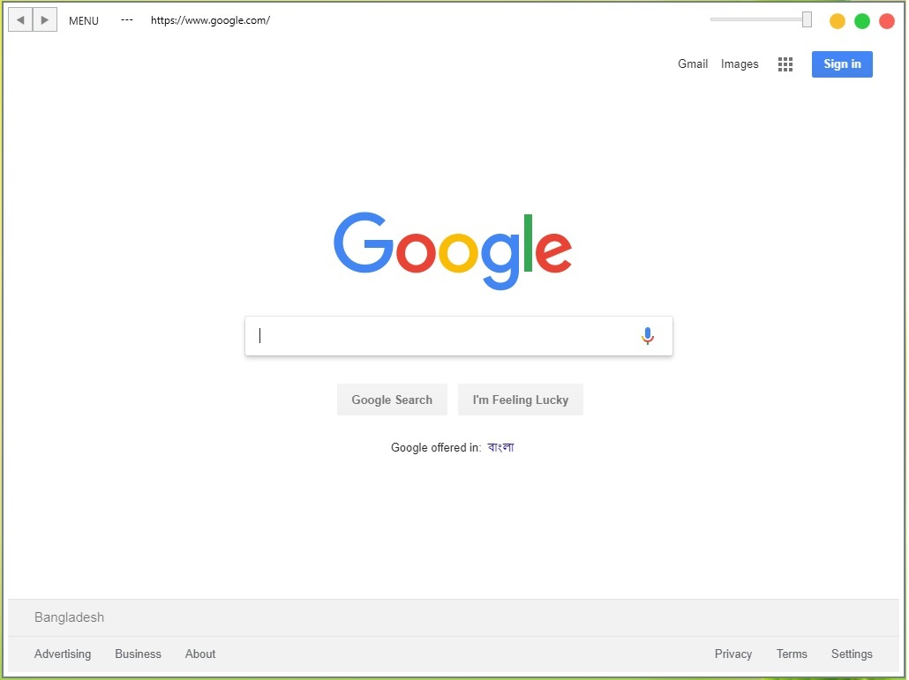
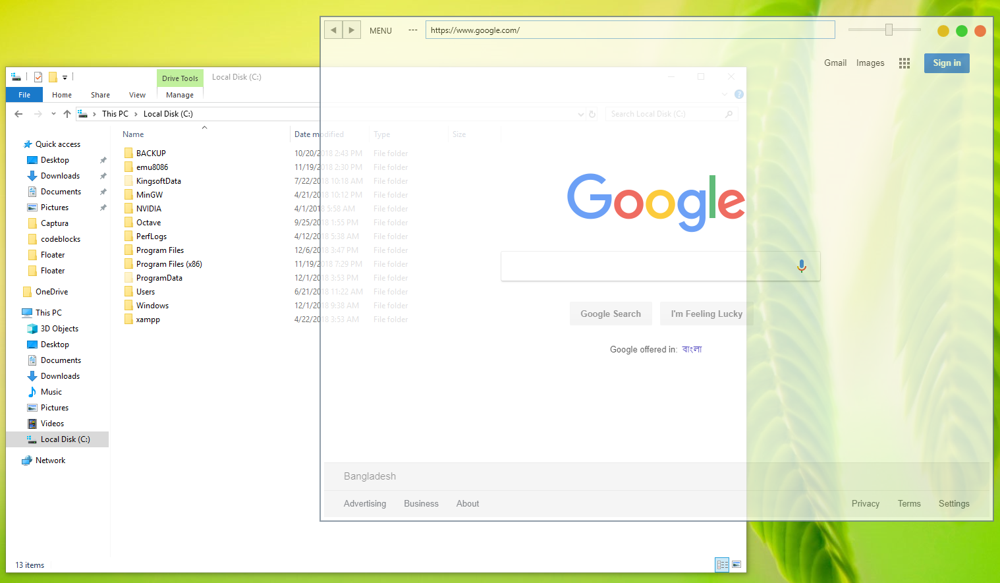
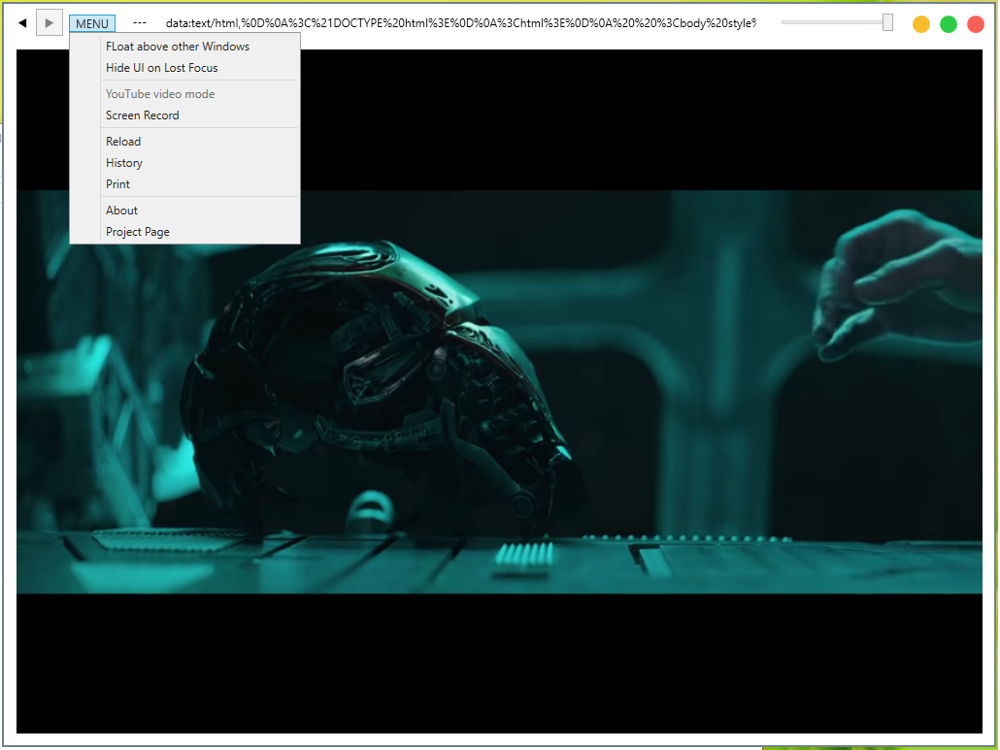

# Floater
A floating web browser built with .NET and Chromium (Chromium Embed Framework) for Windows.

### Features
1. Float above all other windows (perfect for watching video or chat when doing something else e.g following a tutorial)
2. Transparent Window
3. Hide UI elements & dedicated YouTube(r) video mode to watch videos without distraction
4. Clean and Minimal UI

### Developer
Mohammed Sazid Al Rashid
* [LinkedIn](https://linkedin.com/in/sazidz)
* [GitHub](https://github.com/sazid)
* [Stackoverflow](https://stackoverflow.com/users/1941132/sazid)

### License
[MIT License](LICENSE)

This project uses the open source [Captura](https://github.com/MathewSachin/Captura) screen recording software. Check out the project for its own license.
